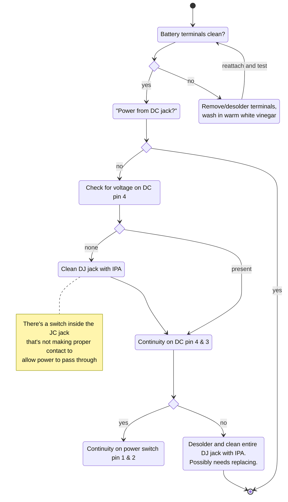

### Fixing Power

1. Visual inspection of battery terminals, if they're free of corrosion, put in fully charged AA batteries and test if the device turns on.

If it turns on then we're good.

If it doesn't turn on, move on to checking power with the DC jack.

2. Does the Gameboy turn on using the DC barrel jack?

If it does, the problem is localised to the battery connection.



```js
insertBatteries();

if (poweredByBatteries()) {
  return READY;
}

removeBatteries();

if (poweredByDC()) {
  // then problem with power getting through to the DC

  removePowerJack();
  insertBatteries();

  if (voltageOnDCPin(4)) {
    // check for continuity on pin 3
    if (continuityBetweenPins(4, 3, "dcjack")) {
      // power is going through the DC jack correct so we'll check the switch
       if (continuityBetweenPins(1, 2, "power_switch")) {
         // then we move onto the power regulator

        // test you're getting 5V out of the regulator.
        // visual inspection of caps, plus short tests

       } else {
         // carefully clean - this can be completely removed and opened to clean
         // the contacts, but make sure to take note of how to put it together again
         cleanPowerSwitch();
         return ISSUE_FOUND;
       }

    } else {
      // there's a switch inside the DC jack that is not making proper contact
      // that allows power to pass through.
      cleanDCJackWithIPA();
      if (!continuityBetweenPins(4, 3)) {
        desolderDCJack();
        cleanDCJackWithIPA();

      }
    }
  } else {
    checkTracesWithMultimeter();
    // we're looking for a break on the traces from the DC pin 4 and the positive
    // battery terminal - once you find the break, you'll need to use a jumper
    // wire to bridge the gap.
    return ISSUE_FOUND;
  }
}
```

